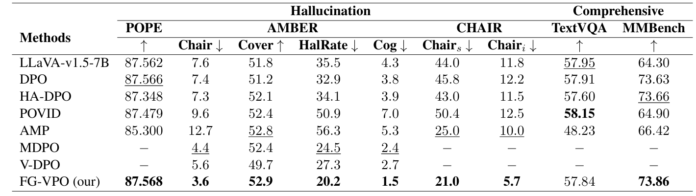

# FG-VPO: Fine-Grained Visual Contrast-Driven Preference Optimization

面向 LVLM 幻觉缓解的细粒度视觉对比偏好优化。

## Background

Large Vision-Language Models (LVLMs) have shown strong performance on image captioning, visual question answering, and multimodal reasoning tasks. However, they can still generate responses that are inconsistent with the input image, known as **multimodal hallucination**.

Traditional DPO-style preference optimization can reduce hallucinations to some extent, but it often relies heavily on textual preference pairs and does not sufficiently strengthen the model's visual grounding. Existing visual-contrast methods may use image removal, blurring, or coarse object edits, which can introduce unstable or misaligned supervision.

This project proposes **FG-VPO**, a fine-grained visual contrast-driven preference optimization framework for reducing LVLM hallucinations while maintaining general multimodal capability.

## Method

FG-VPO introduces visual contrast signals aligned with three common hallucination types:

- **object-level hallucination**;
- **attribute-level hallucination**;
- **relation-level hallucination**.

Based on LLaVA-v1.5-7B, the method uses a diffusion model to construct counterfactual image pairs. These image pairs preserve most visual content while perturbing specific object, attribute, or relation evidence related to hallucinated responses.

The training objective combines:

- text preference alignment;
- generated-response preference alignment;
- fine-grained visual contrast preference alignment.

Together, these objectives encourage the LVLM to rely more on image evidence and improve cross-modal consistency.

## Framework

  

  <em>Figure 1. Framework of FG-VPO.</em>

## Experiments

The method is evaluated on five multimodal benchmarks:

- POPE;
- AMBER;
- CHAIR;
- TextVQA;
- MMBench.

Compared with LLaVA-v1.5-7B and representative DPO-based hallucination mitigation baselines, FG-VPO reduces hallucination rates while keeping general multimodal ability stable.

Main observed results:

- AMBER HalRate decreases from **35.5** to **20.2**;
- CHAIR_s decreases from **44.0** to **21.0**;
- CHAIR_i decreases from **11.8** to **5.7**;
- MMBench remains stable and improves to **73.86**.

## Results

  

  <em>Figure 2. Main experimental results of FG-VPO.</em>

## Notes

This repository is intended for project presentation and research portfolio use. Do not upload private datasets, unreleased model checkpoints, or unauthorized project assets.

